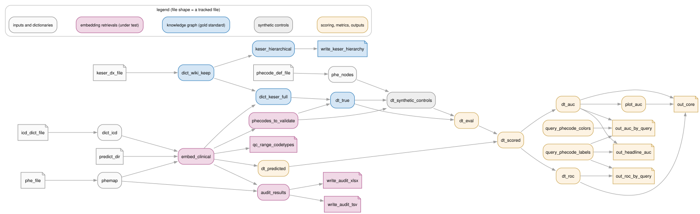

# embed-vs-kgraph-demo

This demo evaluates embedding-based clinical-concept retrieval against a knowledge-graph gold standard. Data is simulated from the public Phecode 1.2 dictionary + Xu et al's statistical knowledge-graph model (PMID: 41982780) tuned to emulate Hong et al's KESER network (PMID: 34707226). 


## Quickstart

```sh
Rscript -e 'renv::restore(prompt = FALSE)'      # one-time: locked R library
make simulate                                    # -> data_sim/phecode/
make pipeline-sim                                # -> scratch/sim_run/phecode/output/dx/
```

On **Windows** (no bash/make needed — plain PowerShell), simulate straight
into `data/` and run the pipeline in place:

```sh
Rscript -e "renv::restore(prompt = FALSE)"
Rscript scripts/simulate_data.R --preset phecode --out data --force
Rscript -e "targets::tar_make()"                 # -> output/dx/
```

Presets (`make simulate SIM_PRESET=...`):

| preset | gold graph | expectation |
|---|---|---|
| `phecode` | logistic edge rule on latent comorbidity vectors | realistic mid-range AUROC/AUPRC |
| `phecode-null` | same, retriever signal `snr = 0` | AUROC ≈ 0.5 (calibration) |
| `phecode-oracle` | deterministic threshold rule, noiseless retriever | AUROC = 1 (calibration) |
| `phecode-xu` | log-linear model via simulated patient sequences (Xu et al. 2026) | realistic; ~3 min |

## Pipeline


1. **Preprocess** — load ranked ICD retrievals per clinical query, split code
   lists/ranges, type ICD codes (ICD-9 vs ICD-10-CM), map to Phecode 1.2.
2. **Gold standard** — load the knowledge-graph diagnosis-diagnosis (dx–dx) edges, 
   check hierarchy closure, expand missing parent phecodes; canonical query-anchored pairs.
3. **Negative controls** — per-query matched synthetic controls at
   negative:positive **ratios** (1–100), four strata: `random`, `non_adjacent`,
   `intracategory`, `degree_matched`. 
4. **Scoring** — canonicalized pairs, scores aggregated per
   `(query, u, v)`; pairs a query never retrieved are **floored** (predicted
   negative), correct for top-k retrieval.
5. **Metrics** — per-query **AUROC and AUPRC together** (sparse graphs inflate
   AUROC), plus full threshold sweeps (sens/spec/PPV/NPV).

The pipeline is a [`targets`](https://docs.ropensci.org/targets/) DAG
(`_targets.R`); `make pipeline-sim` runs it unchanged against a simulated tree
in an isolated run directory.

<details>
<summary>The full <code>targets</code> graph (every data target, coloured by the stage above)</summary>

File shapes are tracked files: raw inputs, written outputs and QC tables.



Regenerate after editing `_targets.R` (host R + GraphViz `dot`; reads
`_targets.R` only, no built store needed):

```sh
make dag                    # or: Rscript scripts/render_dag.R
make figures                # dag + docs/figures/concept.{svg,png} (also needs rsvg-convert)
```

</details>

## Layout

| path | contents |
|---|---|
| `_targets.R` | the pipeline DAG (`targets::tar_make()`) |
| `R/functions.R` | pipeline functions |
| `R/simulate.R` | simulator functions (see `docs/simulator.md`) |
| `scripts/simulate_data.R` | simulator driver (presets, seeds, manifest) |
| `scripts/run_pipeline_sim.sh` | isolated pipeline run against a simulated tree |
| `docs/simulator.md` | the data generating model |
| `docs/SPEC-inputs.md` | the input contract for the simulator's `spec/*.csv` tables |
| `scripts/render_dag.R` | draws the pipeline DAG figure from `_targets.R` |
| `docs/figures/` | README figures: `embed_vs_kgraph.{svg,png}` (the task; script-drawn SVG, PNG via `rsvg-convert`), `concept.dot` + `concept.sh` (the workflow), `pipeline_dag.svg` (generated by `make dag`) |

## Data provenance

The only non-simulated data are the public Phecode 1.2 map + definitions from the PheWAS package generated on first run and cached in `data_sim/_source/`. 
Refs: Denny et al. 2013 (PMID: 24270849), Wu et al. 2019 (PMID: 31553307).
The ICD typing dictionary, gold-standard graph, and ranked retrievals are all simulated.

## License

MIT (see `LICENSE`). The Phecode 1.2 data is fetched at runtime from the
PheWAS package mirror (GPL-3) and is not redistributed in this repository.

## Version 
**R reference implementation, frozen snapshot (2026-08-31)**.